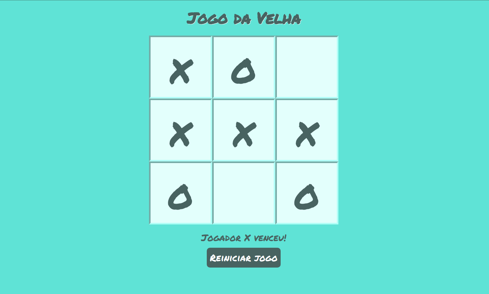

# Jogo da velha

Game criado em HTML, CSS e Node.js do famoso jogo da velha.

 
 
 
 ## Como jogar?
 Basta executar na pasta raiz do projeto o comando a seguir 
 
 ```sh
node server.js
```

E acessar no seu navegador o endereço

 ```sh
http://localhost:3000/
```


### Trabalho referente as matérias

Fundamentos de Computação para Internet - [Ranieri Valença de Carvalho](https://github.com/ranierivalenca)

Programação Imperativa - [Allan Diego Silva Lima](https://github.com/allan-diego)
